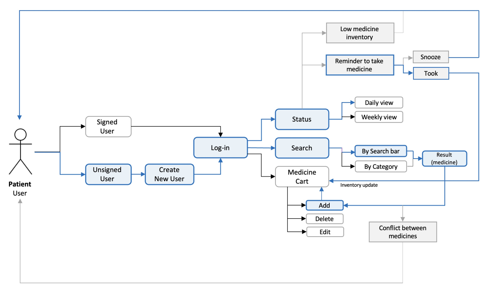
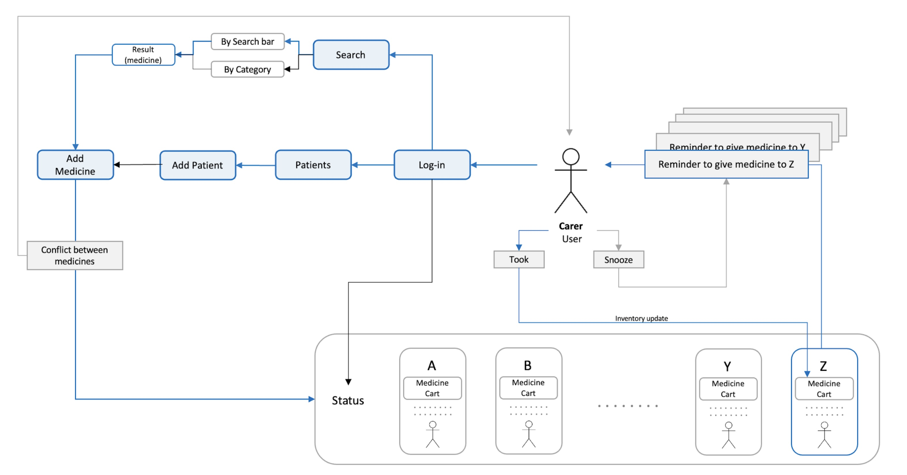
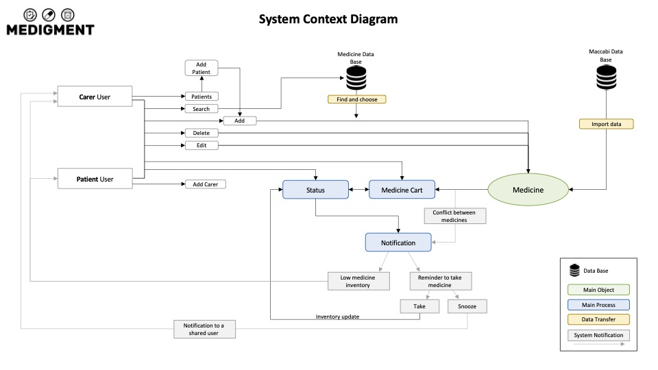

# 💊 Medigment – Medication Management System

## 📌 Project Overview
Medigment is a web-based application designed to help users manage their medication routine effectively and safely.  
The system provides reminders, reliable medical information, and medication inventory management, allowing patients and their carers to coordinate and track medication intake in real-time.

---

## ❗ Problem Statement
Many people face challenges in managing their medication routine:
- Forgetting when and how to take each medication.
- Lack of awareness about possible harmful drug interactions.
- Overwhelming amount of medical information online, which can often be misleading.
- No easy way for carers to monitor and assist patients.

---

## 💡 Solution Approach
The Medigment system addresses these challenges by:
- Sending reminders to the user to take or administer medication on time.
- Allowing a **shared user** (carer) to receive notifications about the patient’s medication adherence.
- Providing **reliable and verified information** about medications.
- Managing the **medication inventory** to prevent running out of essential medicines.

---

## 🧑‍⚕️ Patient Flow


---

## 👩‍⚕️ Carer Flow


---

## 🖥️ System Architecture


---

## ⚙️ Technologies Used
- **Frontend:** HTML, CSS, Bootstrap, JavaScript, jQuery  
- **Backend:** PHP (Procedural)  
- **Database:** MySQL  
- **Server:** Apache (via XAMPP, MAMP, or local Apache server)  

---

## 🚀 Features
- Patient and carer user roles.
- Login and registration system.
- Medication scheduling and reminders.
- Shared access for carers.
- Inventory tracking.
- Verified medical information display.


---

## 📖 Usage Instructions

### 1. **Install PHP**
Ensure PHP is installed on your machine.  

### **2. Download the repository**
```bash
git clone https://github.com/eliyasamary/medigment.git
cd medigment
``` 

### **3. Run the server**
```bash
php -S localhost:8000
```
Then visit:
👉 http://localhost:8000
